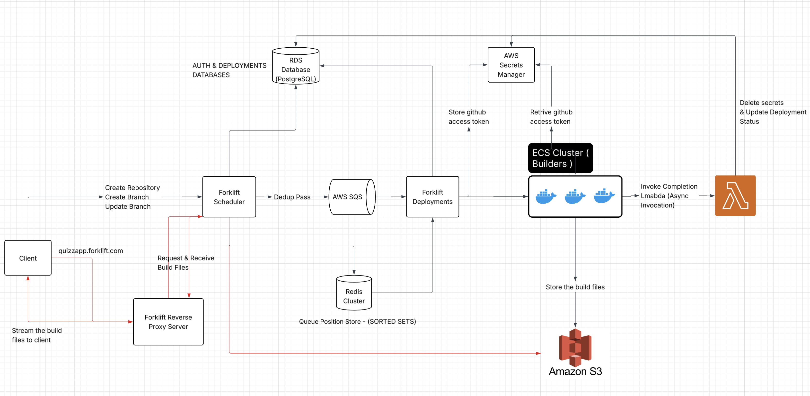

### ⚠️  Note: This is an index page. This project follows a microservice architecture. You can find the links to the individual service repositories below. ⚠️

## Architecture


Black Arrow Lines: Denotes the deployment process<br/>
Red Arrow Lines: Denotes the request from client to a hosted app say quizzapp.forklift.com<br/>

## Service Repositories

### ForkLift Scheduler [Link](https://github.com/waseem-code7/forklift-scheduler)
The core scheduling service for Forklift. It validates incoming deployment requests and queues valid deployments to AWS SQS for processing.

### Forklift Deployment [Link](https://github.com/waseem-code7/forklift-deployment)
This service dynamically launches ECS task containers within the ECS cluster. It also securely stores the GitHub access token in AWS Secrets Manager for access by the ForkLift Builder, and injects all necessary environment variables into the build process.

### Forklift Builder [Link](https://github.com/waseem-code7/forklift-builder)
A Linux-based Docker container responsible for cloning the target repository, validating the codebase, installing dependencies, and building React projects. Upon a successful build, it uploads the output to Amazon S3 and invokes an AWS Lambda function with the build status.
The container is ephemeral — it shuts down automatically once the build and deployment process is completed.

### Forklift Completion Daemon [Link](https://github.com/waseem-code7/forklift-lambdas)
An AWS Lambda function that validates the outcome of deployment, and updates the relevant databases with the final deployment status.

### Forklift Reverse Proxy [Link](https://github.com/waseem-code7/forklift-reverse-proxy)
This service handles client requests for build files. It does not directly access S3; instead, it forwards the request to the ForkLift Scheduler, which streams the required build files back to the client through the reverse proxy.

## Database Schemas
Auth Database

<br/>
Deployments Database

<br/>
S3 Build Path<br/>
```
forklift-builds/{username}/{reponame}/{branch}/{version_id}/
```

## Authentication
The application uses GitHub's OAuth 2.0 flow to securely authenticate users and access their GitHub data. This provides a seamless single sign-on experience while ensuring users maintain control over what data the application can access.

### Flow
1. User initiates login process
2. Forklift Scheduler redirects user to GitHub's authorization server
3. User reviews and approves requested permissions
4. GitHub redirects back to the application with an authorization code
5. Application exchanges the code for an access token
6. Access token is used to make authenticated API requests to GitHub
7. The Forklift Scheduler then return a success response to client with a jwt encoded session id.

#### The application requires the following scopes to function properly:

```read:user```<br/>
Purpose: Read-only access to user profile information<br/>

```repo```<br/>
Purpose: Access to repositories (Public & Private)<br/>

```admin:repo_hook```<br/>
Purpose: Access to create repository webhooks<br/>

## Deployment APIs
1. Add Repository - Add a new repository (Triggers deployment on the default branch) <br/>
   Endpoint: POST /api/v1/repository 
   Request Body 
    ```json
    {
    "name": "string",
    "domain": "string"
    }
    ```
    Response Body
    ```json
    {
        "repository": {
            "repo_id": "string",
            "user_id": "string",
            "repo_name": "string",
            "is_private": true,
            "created_at": "Date",
            "default_branch": "string"
        },
        "branch": {
            "branch_id": "string",
            "repo_id": "string",
            "branch_name": "string",
            "auto_deploy": true,
            "created_at": "Date",
            "updated_at": "Date"
        },
        "deployment": {
            "deployment_id": "string",
            "branch_id": "string",
            "status": "string",
            "commit_id": "string",
            "created_at": "Date"
        }
    }
    ```
2. Add Branch - Add a new branch (Triggers deployment on the specified valid branch) <br/>
   Endpoint: POST /api/v1/branch
   Body
    ```json
    {
    "repo_id": "string",
    "name": "string",
    "domain": "string"
    }
    ```
   Response Body
    ```json
    {
        "repository": {
            "repo_id": "string",
            "user_id": "string",
            "repo_name": "string",
            "is_private": true,
            "created_at": "Date",
            "default_branch": "string"
        },
        "branch": {
            "branch_id": "string",
            "repo_id": "string",
            "branch_name": "string",
            "auto_deploy": true,
            "created_at": "Date",
            "updated_at": "Date"
        },
        "deployment": {
            "deployment_id": "string",
            "branch_id": "string",
            "status": "string",
            "commit_id": "string",
            "created_at": "Date"
        }
    }
    ```
3. Trigger Deployment - Triggers a new deployment on an existing branch. <br/>
   Endpoint: POST /api/v1/deployment
   Body
    ```json
    {
    "repo_id": "string",
    "branch_id": "string"
    }
    ```
   Response Body
    ```json
    {
        "repository": {
            "repo_id": "string",
            "user_id": "string",
            "repo_name": "string",
            "is_private": true,
            "created_at": "Date",
            "default_branch": "string"
        },
        "branch": {
            "branch_id": "string",
            "repo_id": "string",
            "branch_name": "string",
            "auto_deploy": true,
            "created_at": "Date",
            "updated_at": "Date"
        },
        "deployment": {
            "deployment_id": "string",
            "branch_id": "string",
            "status": "string",
            "commit_id": "string",
            "created_at": "Date"
        }
    }
    ```

4. Rollback - Rollbacks the branch deployment to previous version if none specified.<br/>
   Endpoint: POST /api/v1/rollback
     ```json
    {
      "branch_id": "string",
      "version_id": "version_id" 
    }
    ```
    Response Body
    ```json
    {
      "status": "string",
      "version_id": "string" 
    }
    ```
5.  Auto Deploy - Create a push webhook on GitHub.<br/>
    Endpoint: POST /api/v1/hooks/merge
    ```json
    {
      "branch_id": "string",
      "version_id": "version_id" 
    }
    ```
    Response Body
    ```json
    {
        "type": "string",
        "id": "string",
        "name": "string",
        "active": "boolean",
        "config": {
            "url": "string",
            "content_type": "string",
            "insecure_ssl": "string"
        }
    }
    ```
